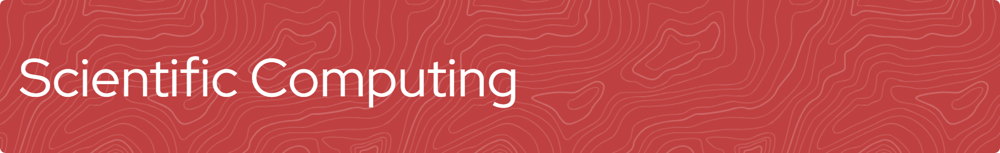

# Scientific Computing wizard; GIS guru; Lord of the CAL (Computer Applications Lab for Scientific Computing); Maestro of Antiquated Technology; Sliding Tile Puzzle Master; Gremlin Hunter.

> ***"Cast your gaze upon the capital of your empire, and you will find two classes of citizens. The one, glutted with riches, displays an opulence which offends those it does not corrupt; the other, mired in destitution, worsens its condition by wearing a mask of posterity which it does not possess: for such is the power of gold (when it is become the god of a nation, stand in the stead of all talent, takes the place of every virtue) that one must either have wealth or feign to have it."***

[**L'Histoire philosophique et politique des établissements et du commerce des Européens dans les deux Indes, 1770**](https://gallica.bnf.fr/ark:/12148/bpt6k109690m.pdf)

 ## Skills

<table style="width: 100%; border: 0px solid white;">
 <tr>
<td style="text-align: center; border: 0px; padding: 12px;"></td>
<td style="text-align: center; border: 0px; padding: 12px;"></td>
  <td style="text-align: center; border: 0px; padding: 12px;"></td>
<td style="text-align: center; border: 0px; padding: 12px;"></td><td style="text-align: center; border: 0px; padding: 12px;"></td><td style="text-align: center; border: 0px; padding: 12px;"></td><td style="text-align: center; border: 0px; padding: 12px;"></td><td style="text-align: center; border: 0px; padding: 12px;"></td></table>

 ## GitHub Stats

  
  

<!---

--->
<!---

  
 

--->
 <!---
 
--->

<!---
DavidGeeraerts/DavidGeeraerts is a ✨ special ✨ repository because its `README.md` (this file) appears on your GitHub profile.
You can click the Preview link to take a look at your changes.
--->
<!---
- 📫 How to reach [me](https://helpwiki.evergreen.edu/wiki/index.php/User:Geeraerd) or 
--->
